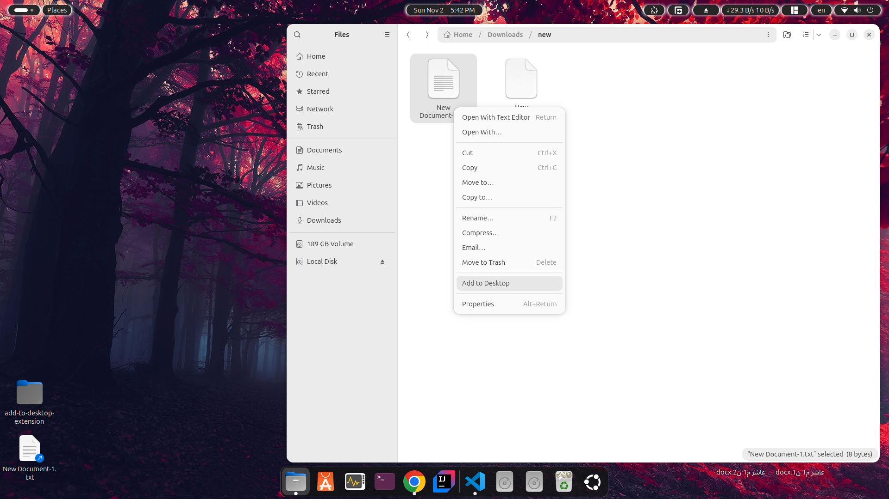

# Nautilus "Add to Desktop" Extension

A Nautilus extension that adds a convenient "Add to Desktop" option to the right-click context menu, allowing you to quickly create symbolic links to files and folders on your desktop.

## Features

- 🖱️ **Right-click Integration**: Simple context menu option in Nautilus
- 🔗 **Smart Linking**: Creates symbolic links (not copies) to save space
- 🎯 **Conflict Resolution**: Automatically handles name conflicts with numbering
- ↩️ **Undo Functionality**: Quick undo option via desktop notifications
- 📢 **Desktop Notifications**: Success/error feedback with actionable buttons
- 🗂️ **Works with Everything**: Files, folders, multiple selections

## Installation

### Method 1: Debian Package (Recommended for Ubuntu/Debian Users)

**Easy Installation - Just double-click the .deb file or use:**

```bash
# Download the package (replace with actual download URL)
wget https://github.com/yourusername/nautilus-add-to-desktop/releases/download/v1.0.0/nautilus-add-to-desktop_1.0.0_all.deb

# Install with automatic dependency resolution
sudo apt install ./nautilus-add-to-desktop_1.0.0_all.deb
```

**Alternative installation:**
```bash
sudo dpkg -i nautilus-add-to-desktop_1.0.0_all.deb
# If there are dependency issues:
sudo apt-get install -f
```

The package will automatically:
- Install all required dependencies
- Set up the D-Bus service
- Restart Nautilus
- Make the extension immediately available

### Method 2: Development Installation (From Source)

**For developers or advanced users:**

```bash
git clone https://github.com/yourusername/nautilus-add-to-desktop.git
cd nautilus-add-to-desktop

# Method A: Using Make (Recommended)
make install
nautilus -q

# Method B: Using install script
chmod +x install.sh
./install.sh
```

## Usage

1. **Right-click** any file or folder in Nautilus
2. Select **"Add to Desktop"** from the context menu
3. A symbolic link will instantly appear on your desktop
4. Get a notification with an **"Undo"** button to quickly remove it
5. **Multiple selections** are supported - select several items and add them all at once

## Screenshot


*Right-click context menu showing "Add to Desktop" option*

## Uninstallation

### If installed via Debian package (.deb)

```bash
sudo apt remove nautilus-add-to-desktop
```

### If installed from source

```bash
make uninstall
# This will remove all extension files and restart Nautilus
```

**Manual removal (if needed):**
```bash
rm -f ~/.local/share/nautilus-python/extensions/add-to-desktop.py
rm -f ~/.local/share/dbus-1/services/org.my.desktop_linker.service
rm -f ~/.local/share/applications/org.my.desktop_linker.desktop
rm -f ~/.local/bin/add-to-desktop-service
nautilus -q
```

## System Requirements

- **OS**: Ubuntu 20.04+ or Debian-based distribution
- **Python**: Python 3.6+
- **Dependencies**:
  - `python3-nautilus` - Nautilus Python extension support
  - `python3-gi` - Python GObject introspection
  - `gir1.2-gtk-4.0` - GTK 4 bindings for notifications

**Note:** All dependencies are automatically installed with the .deb package

## Building the Package

To build your own .deb package:

```bash
# The package structure is already set up
dpkg-deb --build debian-package/nautilus-add-to-desktop
mv debian-package/nautilus-add-to-desktop.deb ./nautilus-add-to-desktop_1.0.0_all.deb
```

## Troubleshooting

**Extension not showing up?**

- Restart Nautilus: `nautilus -q`
- Check if python3-nautilus is installed: `apt list python3-nautilus`
- Log out and back in

**D-Bus service issues?**

- Reload D-Bus: `systemctl --user daemon-reload`
- Check service status: `systemctl --user status org.my.desktop_linker`

## Contributing

1. Fork the repository
2. Create your feature branch (`git checkout -b feature/amazing-feature`)
3. Commit your changes (`git commit -m 'Add amazing feature'`)
4. Push to the branch (`git push origin feature/amazing-feature`)
5. Open a Pull Request

## License

MIT License - feel free to use, modify, and distribute!

## Changelog

### v1.0.0

- Initial release
- Right-click context menu integration
- Symbolic link creation with conflict resolution
- Desktop notifications with undo functionality
- Debian package for easy distribution
